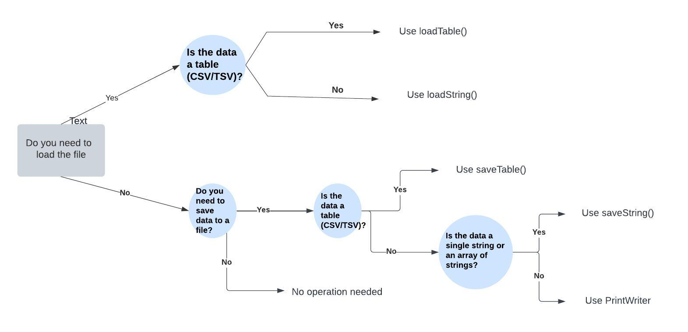

# Table of content

- [Class design](#class-design)
- [Arrays vs ArrayList](#arrays-and-arraylist-in-processing)
- [File Operations](#file-operations)
  - [How to decide](#how-to-decide-which-to-use)
  - [loadStrings](#loadstrings)
  - [loadTable](#loadtable)
    - [loadTable with direct access](#loadtable-with-direct-index-access)
  - [saveString](#savestrings)
  - [saveTable](#savetable)
  - [PrintWriter](#printwriter)
- [Hit Detection](#hit-detection)
- [Animation](#animation)
- [Code Examples](#code-examples)
  - [Button hit](#button-hit-example)
  - [Printwriter](#printwriter)
  - [Animation](#animation-example)
  - [Animation for shellfish](#shellfish-animation-example)
  - [Load table as matrix](#load-table-for-matrix)
  - [Load table with header](#load-table-with-header)
  - [Load table without header](#load-table-without-header)

# Class design

## Parts of the class

- Attributes
- Constructor
- Methods

**REMEMBER**: every attribute has to have values at some point, either from the contructor parameter or set it to default

## Working with classes

### Create new instance
To use a class you need a new instance of it, which will be an object. The new will call one of the constructors from the class.
```java
MyClass obj = new MyClass();
```

### Get attributes
You can get attributes from the class, with the point operation.
For example to load the number attribute to the myint variable you can:
```java
int myint = obj.number;
```

### Set attributes
You can set the attributes as well similar the syntax when you get
```java
obj.number = myint;
```

### Call methods
You can also call the methods on the class, e.g. to call the display:
```java
obj.display()
```


## Typical methods

- `void display()`:  this will handle how to show the object of the class. Usually contains an image or shape
- `boolean checkHit(float mX, float mY)`: this will decide if someone clicked on it. It can return values, however there are certain cases when we can handle what should happen when we click on the object (e.g. Fish isCaught example)
- `void update()`: if the objects needs to change or moved we use this

## Classes to show something

If we talk about the classes which represents multiple things on the picture like fields, fishes, batteries, stars etc. we need to store them.
It can be stored directly in the main class as a global variable or in a container class like a FishTank or a GameField.
These objects can be stored in:
- Array
- ArrayList

The difference between the two is basically when you insert an element the ArrayList is easier to use, you don't need to know the exact size beforehand.

There are multiple ways to interact with these classes, usually you need to:
1. show them -> call the dispay() functions for all the objects
2. check if we click them -> call the checkHit function for all the objects
For both of the cases you need for cycle, in the display() and in the mousePressed functions


# Arrays and ArrayList in Processing

## Introduction

In Processing, both arrays and ArrayList can be used to store collections of elements. Arrays have a fixed size, while ArrayList can dynamically resize. This tutorial will cover the basics of both, provide practical examples, and guide you on when to use each.

## Arrays

### Description

An array is a fixed-size collection of elements of the same type. Once an array is created, its size cannot be changed.

### Example

```java
int[] numbers = new int[5]; // Create an array of 5 integers
numbers[0] = 10;
numbers[1] = 20;
numbers[2] = 30;
numbers[3] = 40;
numbers[4] = 50;

for (int i = 0; i < numbers.length; i++) {
    println("Number at index " + i + ": " + numbers[i]);
}
```

### When to Use

- When the number of elements is known and fixed.
- When you need fast access to elements by index.

## ArrayList

### Description

ArrayList is a resizable array, which can grow or shrink as needed. It is part of the Java Collections Framework and provides more flexibility compared to arrays.

### Example

```java
ArrayList<Integer> numbers = new ArrayList<Integer>();

numbers.add(10);
numbers.add(20);
numbers.add(30);
numbers.add(40);
numbers.add(50);

for (int i = 0; i < numbers.size(); i++) {
    println("Number at index " + i + ": " + numbers.get(i));
}
```

### When to Use

- When the number of elements is unknown or may change.
- When you need to add or remove elements frequently.
- When you need more functionality, such as dynamic resizing.

## Practical Example: Storing and Displaying Shapes

[Arrays](#arrays)
[ArrayList](#arraylist)

### Summary

- Use arrays when the number of elements is fixed and you need fast access by index.
- Use ArrayList when the number of elements is dynamic and you need more flexible operations like adding or removing elements.

Both arrays and ArrayList have their use cases, and understanding when to use each will help you write more efficient and maintainable code in Processing.


# File operations

## Decision Tree for File Operations in Processing

### How to decide which to use:


### loadStrings
**Description**: `loadStrings` loads text from a file and returns it as an array of strings, where each element represents a line of text.

**Code Example**:
```java
String[] lines = loadStrings("example.txt");
for (String line : lines) {
    println(line);
}
```

### loadTable
**Description**: `loadTable` loads data from a CSV (Comma Separated Values) or TSV (Tab Separated Values) file and returns it as a Table object.
Tables have rows and columns. 
To load certain values from the table you need to loops through the rows use the proper function for each field on the row:
- row.getString()
- row.getFloat()
- row.getInt()

**Code Example**:
```java
Table table = loadTable("data.csv", "header");
for (TableRow row : table.rows()) {
    String name = row.getString("name");
    int age = row.getInt("age");
    println(name + ", " + age);
}
```

Alternatively you can use the row/col index directly:

#### loadTable with Direct Index Access
**Description**: This example demonstrates how to use `loadTable` to load data from a CSV file and access values directly by row and column index without looping through the rows.

**Code Example**:
```java
// Load the table
Table table = loadTable("data.csv");

// Get the number of rows and columns
int rowCount = table.getRowCount();
int columnCount = table.getColumnCount();

// Accessing values by row and column index
for (int row = 0; row < rowCount; row++) {
    for (int col = 0; col < columnCount; col++) {
        String value = table.getString(row, col);
        println("Value at (" + row + ", " + col + "): " + value);
    }
}
```

### saveStrings
**Description**: `saveStrings` saves an array of strings to a file, where each element in the array is written as a new line in the file.

**Code Example**:
```java
String[] lines = { "First line", "Second line", "Third line" };
saveStrings("output.txt", lines);
```

### saveTable
**Description**: `saveTable` saves a Table object to a CSV or TSV file.

**Code Example**:
```java
Table table = new Table();
table.addColumn("name");
table.addColumn("age");

TableRow newRow = table.addRow();
newRow.setString("name", "Alice");
newRow.setInt("age", 30);

saveTable(table, "output.csv");
```

### PrintWriter
**Description**: `PrintWriter` is used to write data to a file incrementally, line by line. 
PrintWriter works similar to the console output. 
- If you need to print a string with line closing use println()
- If you need to print a string without the closing new line use print()

REMEMBER: always close and flush after write

**Code Example**:
```java
PrintWriter output = createWriter("output.txt");

output.println("This is the first line.");
output.println("This is the second line.");

output.flush();
output.close();
```


# Hit detection

Hit detection usually need to be implemented if we click on that element with the mouse.
This need to be implemented in the mousepressed function:

```java
void mousePressed() {
    //do the action here
}
```

The checks are performed within the class itself, where the mouse coordinates are obtained from the mousePressed function. 
The object's position is always at the upper left corner of the image. 
Therefore, you need to verify if the mouse position is to the right of this point and within the left side plus the object's width. 
Additionally, you must ensure that the mouse's y-coordinate is greater than the object's y-coordinate but less than y + height.

REMBEMBER:
- If there is now width or height of the object you need to figure out what should be it
  - Check for size properties or use default constant values.
- The hit can be handled inside or outside the class you hit. 
  - If you only need to modify the current object, handle the event inside the class (modify a field of the class).
  - If you need to know the result outside the class, return a boolean (hit or not).

[Button example](#button-hit-example)

# Animation

For animations, you typically need to load multiple images into the class, preferably using a PImage[] array. You need to determine which image to display and change the image continuously. To manage this, use an integer index to represent the current image.

# Code examples

## Button hit example

```java
  boolean checkHit(float mX, float mY)
  {
    if (mX > position.x && mX < position.x + w 
      && mY > position.y && mY < position.y + h)
    {
      println("clicked: " + caption);
      return true;
    }
    return false;
  }
```

## Load table for matrix

```java
void loadField(String fileName) {
    Table table = loadTable(fileName);
    int rowCount = table.getRowCount();
    int colCount = table.getColumnCount();
    for(int row = 0; row < rowCount ; row++){
      for(int col = 0; col < colCount ; col++){
        TableRow currRow = table.getRow(row);
        int value = currRow.getInt(col);
        allRoadTiles[col][row].currImageIndex = value;
      }
    }
}
```

## Load table without header

```java
void readBooks(){
  Table table = loadTable("books.csv");
  int rowCount = table.getRowCount();
  int currRow = 0;
  int currCol = 0;
  int idx = 0;
  books = new Book[rowCount];
  //for each 
  for(TableRow row : table.rows()){
    String title = row.getString(0); // used the index to get certain values
    String author = row.getString(1);
    Book book = new Book(title, author, price, loadImage(title + ".jpeg"), 200*currCol+20, 400*currRow+100);
    books[idx] = book;
    idx++;
    currCol ++;
    if(currCol == 5) { // this is for 2 dimensional array when we need to maximize the width to 5
      currCol = 0;
      currRow ++;
    }
  }
}
```

## Load table with header

```java
void loadBatteries(){
    Table table = loadTable("basic_batteries.csv", "header");

    int rowCount = table.getRowCount(); 
    int idx = 0;
    batteries = new Battery[rowCount];
    for(TableRow row : table.rows()){
         float x = row.getFloat("x");
         float y = row.getFloat("y");
         float h = row.getFloat("h");
         float current_power = row.getFloat("current_power");
         float max_power = row.getFloat("max_power");
         float speed = row.getFloat("speed");
         Battery battery;
         battery = new Battery(new PVector(x,y), h, speed, current_power,max_power);
         battery.isUsed = true;
         batteries[idx] = battery;
         idx++;
     
    }
}
```

## Printwriter usage

```java
void saveField(String fileName){
   PrintWriter output = createWriter(fileName);
   Date date = new Date();
   output.println("ORDER - " + date);
   output.println("------------------------------------");
   for(Book book: bookList){
       String author = book.author;
       float price = book.price;
       String title = book.title;
       output.println(title + "(Author: " + author + ") - " + price + " euro");
   }
   output.println("------------------------------------");
   output.println("TOTAL PRICE = " + getTotalPrice() + " $");
   output.println("");
   output.println("");
   output.println("handled by Sara");
   output.flush();
   output.close();
 }
```

## Animation example

```java
class Animation {
  PImage[] frames; // the frames in the animation
  int currentFrame; // which is the current image to show
  int totalFrames; // the total number of frames
  int x, y; // Position of the animation

  // Constructor to initialize the animation
  Animation(String[] framePaths, int x, int y) {
    this.x = x;
    this.y = y;
    totalFrames = framePaths.length;
    frames = new PImage[totalFrames];
    
    for (int i = 0; i < totalFrames; i++) {
      frames[i] = loadImage(framePaths[i]);
    }
    
    currentFrame = 0;
  }

  // Method to update and display the animation
  void update() {
    // Display the current frame
    image(frames[currentFrame], x, y);
    
    // Update the frame index
    currentFrame = (currentFrame + 1) % totalFrames; // Loop back to the first frame after the last
  }
}

```

## Shellfish animation example

```java
class ShellFish extends Fish {
  int cols, rows;
  PImage[] frames;
  int currentFrame = 0;
  
  ShellFish(int x, int y, PImage img, int speed, int cols, int rows, int size) {
    super(x, y, img, speed, size);
    this.cols = cols;
    this.rows = rows;
    frames = new PImage[cols * rows];
    int frameWidth = img.width / cols;
    int frameHeight = img.height / rows;
    for (int i = 0; i < rows; i++) {
      for (int j = 0; j < cols; j++) {
        frames[i * cols + j] = img.get(j * frameWidth, i * frameHeight, frameWidth, frameHeight);
      }
    }
  }

  void animate() {
    currentFrame = (currentFrame + 1) % frames.length;
    img = frames[currentFrame];
  }

  @Override
  void move() {
    super.move();
    animate();
  }
}
```

### Using Arrays

```java
class Circle {
    float x, y, r;
    
    Circle(float x, float y, float r) {
        this.x = x;
        this.y = y;
        this.r = r;
    }
    
    void display() {
        ellipse(x, y, r*2, r*2);
    }
}

Circle[] circles = new Circle[3];

void setup() {
    size(800, 600);
    circles[0] = new Circle(100, 100, 50);
    circles[1] = new Circle(300, 300, 75);
    circles[2] = new Circle(500, 200, 100);
}

void draw() {
    background(255);
    for (int i = 0; i < circles.length; i++) {
        circles[i].display();
    }
}
```

### Using ArrayList

```java
class Circle {
    float x, y, r;
    
    Circle(float x, float y, float r) {
        this.x = x;
        this.y = y;
        this.r = r;
    }
    
    void display() {
        ellipse(x, y, r*2, r*2);
    }
}

ArrayList<Circle> circles = new ArrayList<Circle>();

void setup() {
    size(800, 600);
    circles.add(new Circle(100, 100, 50));
    circles.add(new Circle(300, 300, 75));
    circles.add(new Circle(500, 200, 100));
}

void draw() {
    background(255);
    for (Circle circle : circles) {
        circle.display();
    }
}
```