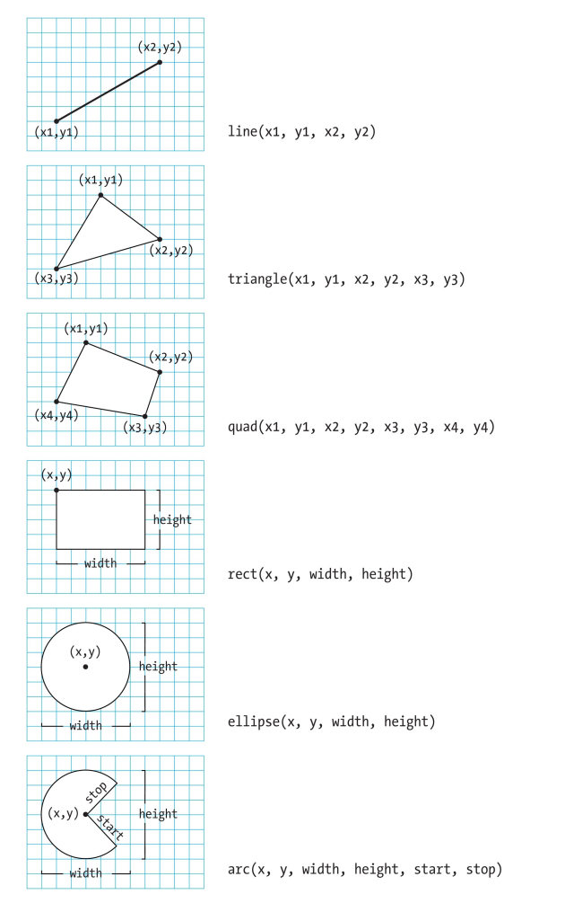

# Basics of Processing

Welcome to the Basics of Processing! This guide is designed to introduce you to the fundamental concepts of the Processing programming language, specifically tailored for beginners with little to no programming experience. Processing is a flexible software sketchbook and language for learning how to code within the context of the visual arts.

## Getting Started

### Installation
1. Visit the [Processing website](https://processing.org/download/).
2. Download the version compatible with your operating system.
3. Follow the installation instructions on the site.

### Running Your First Program
Open Processing, and you'll see an environment where you can type your code. Here's a simple program to get you started:

```java
void setup() {
    size(480, 120);
    background(204);
}

void draw() {
    ellipse(140, 60, 50, 50);
}
```
Copy and paste this code into the Processing editor and press the 'Run' button. You should see a window displaying a circle.

## Key Concepts

### Setup and Draw Functions
- **`setup()`**: This function runs once when you start your program. Use it to set initial environment properties, such as screen size and background color.
- **`draw()`**: This function continuously executes the lines of code contained inside its block until the program is stopped or no longer in use. It's ideal for animations.

### Basic Drawing
- **Shapes**: Use functions like `ellipse()`, `rect()`, `line()`, and `point()` to draw simple shapes.
```java
  // Draw a rectangle
  rect(50, 50, 75, 100); // rect(x, y, width, height)
```
- **Color**: Use `fill()`, `stroke()`, and `background()` to color these shapes.
```java
  // Set colors
  fill(255, 204, 0); // Fill color (yellow)
  stroke(0, 102, 153); // Stroke color (blue)
```

### Interactivity
- **Mouse Input**: Make your sketches interactive by using mouse variables like `mouseX`, `mouseY`.
```java
  // Draw a circle that follows the mouse
  void draw() {
  background(204); // Clear screen with a background
  ellipse(mouseX, mouseY, 20, 20); // Circle follows mouse position
  }
 ```

### Examples
To help you understand the basics, here are a few simple examples:

**Example 1: Static Drawing**
```java
void setup() {
    size(400, 400);
    background(255);
    noStroke();
    fill(100, 200, 100);
    ellipse(200, 200, 150, 150);
}
```

**Example 2: Interactive Example**
```java
void setup() {
    size(400, 400);
}

void draw() {
    background(255);
    fill(255, 0, 0);
    ellipse(mouseX, mouseY, 50, 50);
}
```

### Main functions

#### Draw
```java
void draw() {
    // Displays the frame count to the Console
    println("I'm drawing");
    println(frameCount);
}
```

#### Setup
```java
void setup() {
    println("I'm starting");
}
void draw() {
    println("I'm running");
}
```

## Main variables

| Variable Name                    | Description                                                                 | Example Usage                                                                                     |
|----------------------------------|-----------------------------------------------------------------------------|---------------------------------------------------------------------------------------------------|
| `width` & `height`               | Dimensions of the display window set by the `size()` function.              | `size(400, 400);` to set width and height.                                                        |
| `frameRate`                      | Target frame rate of the sketch.                                            | `frameRate(30);` to set the sketch to 30 fps.                                                     |
| `frameCount`                     | Number of frames displayed since the start of the program.                  | `println(frameCount);` to print the frame count.                                                  |
| `displayWidth` & `displayHeight` | Dimensions of the computer's display screen.                                | `println(displayWidth + "x" + displayHeight);`                                                    |
| `mouseX` & `mouseY`              | Current mouse positions.                                                    | `ellipse(mouseX, mouseY, 20, 20);` draw circle at mouse position.                                 |
| `pmouseX` & `pmouseY`            | Mouse positions in the previous frame.                                      | `line(pmouseX, pmouseY, mouseX, mouseY);` to draw a line from previous to current mouse position. |
| `mousePressed`                   | True if a mouse button is pressed.                                          | `if (mousePressed) {fill(255);} else {fill(0);}`                                                  |
| `mouseButton`                    | Indicates which mouse button was pressed.                                   | `if (mouseButton == LEFT) {println("Left button");}`                                              |
| `key`                            | Value of the last key pressed.                                              | `if (key == 'a') {println("A was pressed.");}`                                                    |
| `keyCode`                        | Detects special keys like UP, DOWN, LEFT, RIGHT, etc.                       | `if (keyCode == UP) {y -= 10;}` to move something up.                                             |
| `keyPressed`                     | True if any key is pressed.                                                 | `if (keyPressed) {background(0);}`                                                                |
| `pixels[]`                       | Array containing the color values for all the pixels in the display window. | `loadPixels(); pixels[0] = color(255); updatePixels();`                                           |


## Basic functions

| Function Name     | Purpose                                                                             | Example                                                                                      |
|-------------------|-------------------------------------------------------------------------------------|----------------------------------------------------------------------------------------------|
| `setup()`         | Called once at the start of the sketch to set initial conditions.                   | ```processing void setup() { size(400, 400); background(255); } ```                          |
| `draw()`          | Continuously executed for animations and input detection.                           | ```processing void draw() { background(204); ellipse(mouseX, mouseY, 10, 10); } ```          |
| `mousePressed()`  | Called once every time a mouse button is pressed.                                   | ```processing void mousePressed() { fill(0); ellipse(mouseX, mouseY, 20, 20); } ```          |
| `mouseReleased()` | Called once every time a mouse button is released.                                  | ```processing void mouseReleased() { fill(255, 0, 0); ellipse(mouseX, mouseY, 20, 20); }```  |
| `keyPressed()`    | Automatically called when a key is pressed and often used to handle keyboard input. | ```processing void keyPressed() { if (key == 'a') { println("A key was pressed."); } } ```   |
| `keyReleased()`   | Called when a key is released.                                                      | ```processing void keyReleased() { if (key == 'a') { println("A key was released."); } } ``` |
| `mouseMoved()`    | Called every time the mouse moves and is not pressing a mouse button.               | ```processing void mouseMoved() { line(mouseX, mouseY, pmouseX, pmouseY); } ```              |
| `mouseDragged()`  | Called during the dragging of the mouse while a button is pressed.                  | ```processing void mouseDragged() { ellipse(mouseX, mouseY, 20, 20); } ```                   |


## Basic shapes

| Shape Name   | Description                                                                     | Example                                                                 |
|--------------|---------------------------------------------------------------------------------|-------------------------------------------------------------------------|
| `point()`    | Draws a point at the specified coordinates.                                     | ```processing void draw() { point(50, 50); } ```                        |
| `line()`     | Draws a line between two points.                                                | ```processing void draw() { line(30, 20, 85, 75); } ```                 |
| `ellipse()`  | Draws an ellipse (circle) at specified coordinates with given width and height. | ```processing void draw() { ellipse(50, 50, 80, 80); } ```              |
| `rect()`     | Draws a rectangle at specified coordinates.                                     | ```processing void draw() { rect(30, 20, 55, 55); } ```                 |
| `triangle()` | Draws a triangle by specifying the coordinates of its three vertices.           | ```processing void draw() { triangle(30, 75, 58, 20, 86, 75); } ```     |
| `quad()`     | Draws a quadrilateral by specifying four vertices.                              | ```processing void draw() { quad(38, 31, 86, 20, 69, 63, 30, 76); } ``` |
| `arc()`      | Draws an arc with specified center, dimensions, start and stop angles.          | ```processing void draw() { arc(50, 50, 80, 80, 0, HALF_PI); } ```      |



## Input/output

### Processing File I/O Functions

| Function Name | Purpose                                                                                                     | Example                                          |
|---------------|-------------------------------------------------------------------------------------------------------------|--------------------------------------------------|
| `loadStrings` | Reads an entire file and returns an array of strings, where each string represents a line in the file.      | `String[] lines = loadStrings("data.txt");`      |
| `saveStrings` | Writes an array of strings to a file. Each string is written as a separate line.                            | `saveStrings("output.txt", lines);`              |
| `loadTable`   | Reads a table formatted file (like CSV) into a `Table` object, which supports more complex data structures. | `Table table = loadTable("data.csv", "header");` |
| `saveTable`   | Writes a `Table` object to a file. This is useful for exporting data in a structured format like CSV.       | `saveTable(table, "newData.csv", "csv");`        |
| `loadBytes`   | Reads the contents of a file into a byte array. This is useful for binary data.                             | `byte[] bytes = loadBytes("image.png");`         |
| `saveBytes`   | Writes a byte array to a file. This can be used to save binary data like images or serialized objects.      | `saveBytes("output.bin", bytes);`                |
| `loadJSON`    | Loads a JSON file into a JSON object, which is useful for structured data that isn't strictly tabular.      | `JSONObject json = loadJSON("data.json");`       |
| `saveJSON`    | Saves a JSON object to a file, which is helpful for data interchange with web services and APIs.            | `saveJSON(json, "newData.json");`                |
| `loadXML`     | Loads an XML file into an XML object, useful for data that benefits from a hierarchical structure.          | `PXML xml = loadXML("data.xml");`                |
| `saveXML`     | Saves an XML object to a file, typically used for configurations or data with nested structures.            | `saveXML(xml, "newData.xml");`                   |

### Usage and Tips
- **Text Files**: `loadStrings` and `saveStrings` are straightforward for dealing with simple text data. These functions are ideal for reading and writing logs, configuration files, or any data that can be represented as plain text.
- **Structured Data**: `loadTable` and `saveTable` are more suited for structured data like spreadsheets or databases exported as CSV files. They handle rows and columns of data and can parse headers.
- **Binary Data**: `loadBytes` and `saveBytes` are useful for handling data that isn't human-readable, such as binary files. This can include images or files that store serialized data.
- **JSON and XML**: `loadJSON`, `saveJSON`, `loadXML`, and `saveXML` are crucial for web-based applications or those needing to store and retrieve data in a structured format that supports hierarchies and nested data.


### Processing Array Functions

| Function Name | Purpose                                                                                        | Example                                                                                                                      |
|---------------|------------------------------------------------------------------------------------------------|------------------------------------------------------------------------------------------------------------------------------|
| `append()`    | Adds a new element to the end of an array.                                                     | `int[] nums = {1, 2, 3};`<br>`nums = append(nums, 4); // nums is now {1, 2, 3, 4}`                                           |
| `shorten()`   | Decreases the size of an array by removing the last element.                                   | `String[] words = {"hello", "world"};`<br>`words = shorten(words); // words is now {"hello"}`                                |
| `expand()`    | Increases the size of an array to a specified new size.                                        | `float[] values = new float[3];`<br>`values = expand(values, 5); // increases the size of values to 5`                       |
| `concat()`    | Concatenates two arrays into one.                                                              | `int[] first = {1, 2};`<br>`int[] second = {3, 4};`<br>`int[] combined = concat(first, second); // combined is {1, 2, 3, 4}` |
| `reverse()`   | Reverses the order of an array.                                                                | `char[] letters = {'A', 'B', 'C'};`<br>`letters = reverse(letters); // letters is now {'C', 'B', 'A'}`                       |
| `sort()`      | Sorts an array of numbers or strings in ascending order.                                       | `int[] unsorted = {10, 2, 32, 3};`<br>`unsorted = sort(unsorted); // unsorted is now {2, 3, 10, 32}`                         |
| `splice()`    | Inserts or removes elements from an array at a specified index.                                | `int[] list = {1, 2, 3, 5};`<br>`list = splice(list, 4, 3); // Inserts 4 at index 3: list becomes {1, 2, 3, 4, 5}`           |
| `subset()`    | Creates a subset of an array starting at a specific index and optionally specifies the length. | `int[] numbers = {1, 2, 3, 4, 5};`<br>`int[] part = subset(numbers, 1, 3); // part is {2, 3, 4}`                             |

### Usage and Tips
- These functions enhance the usability of arrays in Processing, making them more flexible for dynamic and iterative operations often required in creative coding and visual applications.


## Next Steps
Explore more complex shapes, control structures (like loops and conditionals), and start creating your own interactive and animated sketches. Processing has a robust [online reference](https://processing.org/reference/) and community with numerous examples and tutorials that can help expand your knowledge and skills.
